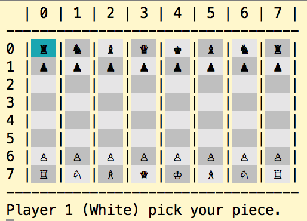

# Chess

## Overview
The purpose of this project was to demonstrate object oriented principles by developing a chess game playable in the terminal.

## Dependencies
* Ruby
* Colorize Gem - run `gem install colorize` to install

## Installation and Setup
1. Download or clone repository to local machine.
2. Navigate into the chess directory.
3. Run the game by executing `ruby game.rb`.
4. Navigate the cursor to the piece you wish to move using the arrow keys on the keyboard.  Terminal will re-render the board each time the cursor moves.

## Example Screenshot

